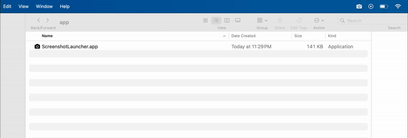
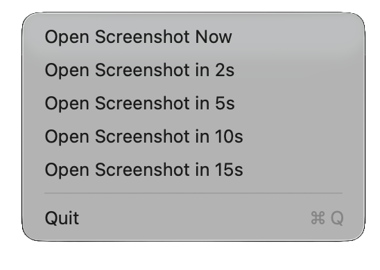

# ScreenshotLauncher

**ScreenshotLauncher** is a lightweight macOS menu bar app that provides quick access to the built-in Screenshot utility. It runs as a status bar item and allows you to open the Screenshot app instantly or with a configurable delay.

  


---

## Features

- **Status Bar Icon**: Appears in the macOS menu bar with a camera icon.  
- **Quick Screenshot Access**: 
  - Left-click the icon to instantly open `/System/Applications/Utilities/Screenshot.app`. 
  - Right-click to open the context menu option (Open Screenshot Now, Open in 5s, Open in 10s, Open in 15s, Quit)
- **Dynamic Countdown:** When you pick a delayed option, the menu item updates every second (e.g., “Opening Screenshot in 14s…”). If a new delay is chosen, the previous countdown is canceled and replaced.
- **Context Menu**: Right-click the icon to show a menu with a “Quit” option.  
- **Lightweight**: Runs without a dock icon, keeping your workflow clean.  

---

## Installation

You can either download a prebuilt version or build the app yourself :

### Option 1: Download Prebuilt ZIP or DMG

Download the latest release of **ScreenshotLauncher** for your architecture:

####  Apple Silicon (arm)
- [Download ScreenshotLauncher-arm64.dmg](https://github.com/snghnaveen/screenshot-launcher/raw/refs/heads/main/dist/ScreenshotLauncher-arm64.dmg)
- [Download ScreenshotLauncher-arm64.zip](https://github.com/snghnaveen/screenshot-launcher/raw/refs/heads/main/dist/ScreenshotLauncher-arm64.zip)
---
#### 🖥️ Intel Chip (x86_64)
- [Download ScreenshotLauncher-x86_64.dmg](https://github.com/snghnaveen/screenshot-launcher/raw/refs/heads/main/dist/ScreenshotLauncher-x86_64.dmg)
- [Download ScreenshotLauncher-x86_64.zip](https://github.com/snghnaveen/screenshot-launcher/raw/refs/heads/main/dist/ScreenshotLauncher-x86_64.zip)
---
#### 🌐 Universal (Apple + Intel in one)
- [Download ScreenshotLauncher-universal.dmg](https://github.com/snghnaveen/screenshot-launcher/raw/refs/heads/main/dist/ScreenshotLauncher-universal.dmg)
- [Download ScreenshotLauncher-universal.zip](https://github.com/snghnaveen/screenshot-launcher/raw/refs/heads/main/dist/ScreenshotLauncher-universal.zip)
---

> After downloading, either unzip the `.zip` file or open the `.dmg`, then move `ScreenshotLauncher.app` to your Applications folder or run it directly.

> When you first open ScreenshotLauncher, macOS may warn that it’s from an unidentified developer. 
This is normal for apps downloaded outside the App Store. To open it, follow Apple’s official instructions here: [Open a Mac app from an unknown developer](https://support.apple.com/en-in/guide/mac-help/mh40616/26/mac/26)

---

### Option 2: Build from source
1. Clone the repository:
    ```bash
    git clone https://github.com/snghnaveen/screenshot-launcher.git
    cd screenshot-launcher
    ```
2. Build the app using the included script:
    ```bash
    ./build.sh
    ```
3. The `.app` bundle will be generated in:
    ```bash
    .build/app/{arch}/ScreenshotLauncher.app
    ```
4. Open the app by double-clicking it, or move it to the Applications folder if you want it available system-wide.

## Motivation

I used to rely on the MacBook Touch Bar, where I could keep a dedicated icon for quickly taking screenshots.  
When I started using a Mac without a Touch Bar, I found myself constantly pressing keyboard shortcuts to access the Screenshot utility.  

To make my workflow easier and more convenient, I built **ScreenshotLauncher** to keep a clickable screenshot icon in the macOS menu bar.
